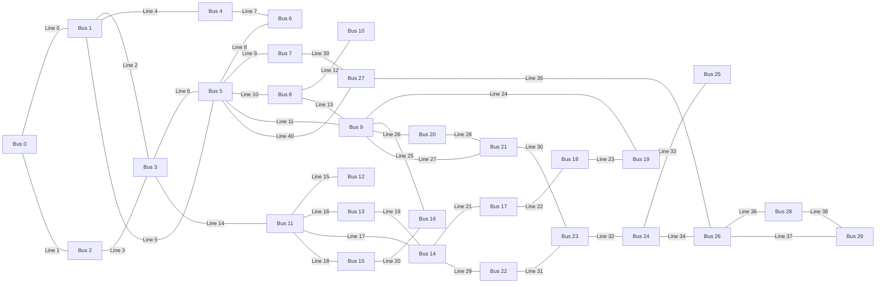

# IEEE 30-bus model connectivity

Connectivity schematic using pandapower bus and line indices.
This is not a field-verified transmission or substation one-line drawing.

```mermaid
graph LR
  b0["Bus 0"]
  b1["Bus 1"]
  b2["Bus 2"]
  b3["Bus 3"]
  b4["Bus 4"]
  b5["Bus 5"]
  b6["Bus 6"]
  b7["Bus 7"]
  b8["Bus 8"]
  b9["Bus 9"]
  b10["Bus 10"]
  b11["Bus 11"]
  b12["Bus 12"]
  b13["Bus 13"]
  b14["Bus 14"]
  b15["Bus 15"]
  b16["Bus 16"]
  b17["Bus 17"]
  b18["Bus 18"]
  b19["Bus 19"]
  b20["Bus 20"]
  b21["Bus 21"]
  b22["Bus 22"]
  b23["Bus 23"]
  b24["Bus 24"]
  b25["Bus 25"]
  b26["Bus 26"]
  b27["Bus 27"]
  b28["Bus 28"]
  b29["Bus 29"]
  b0 ---|"Line 0"| b1
  b0 ---|"Line 1"| b2
  b1 ---|"Line 2"| b3
  b2 ---|"Line 3"| b3
  b1 ---|"Line 4"| b4
  b1 ---|"Line 5"| b5
  b3 ---|"Line 6"| b5
  b4 ---|"Line 7"| b6
  b5 ---|"Line 8"| b6
  b5 ---|"Line 9"| b7
  b5 ---|"Line 10"| b8
  b5 ---|"Line 11"| b9
  b8 ---|"Line 12"| b10
  b8 ---|"Line 13"| b9
  b3 ---|"Line 14"| b11
  b11 ---|"Line 15"| b12
  b11 ---|"Line 16"| b13
  b11 ---|"Line 17"| b14
  b11 ---|"Line 18"| b15
  b13 ---|"Line 19"| b14
  b15 ---|"Line 20"| b16
  b14 ---|"Line 21"| b17
  b17 ---|"Line 22"| b18
  b18 ---|"Line 23"| b19
  b9 ---|"Line 24"| b19
  b9 ---|"Line 25"| b16
  b9 ---|"Line 26"| b20
  b9 ---|"Line 27"| b21
  b20 ---|"Line 28"| b21
  b14 ---|"Line 29"| b22
  b21 ---|"Line 30"| b23
  b22 ---|"Line 31"| b23
  b23 ---|"Line 32"| b24
  b24 ---|"Line 33"| b25
  b24 ---|"Line 34"| b26
  b27 ---|"Line 35"| b26
  b26 ---|"Line 36"| b28
  b26 ---|"Line 37"| b29
  b28 ---|"Line 38"| b29
  b7 ---|"Line 39"| b27
  b5 ---|"Line 40"| b27
```
